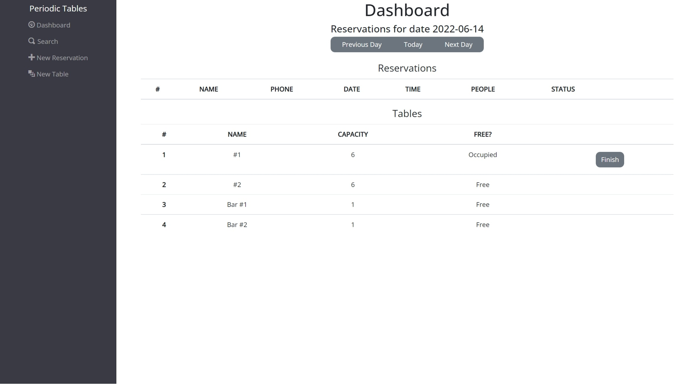
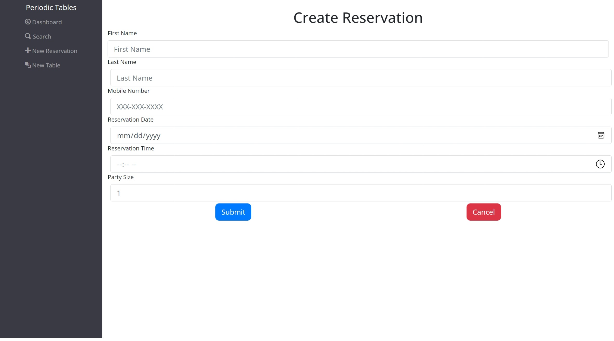
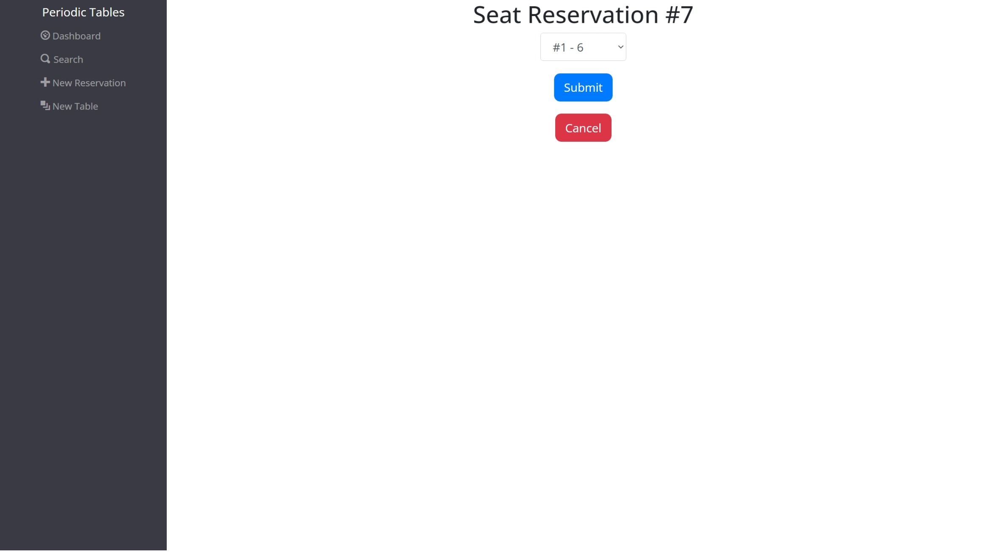

# Capstone: Restaurant Reservation System
An application built for restaurant employees to keep track of customer reservations. It allows employees to seat, search, and add reservations as well as tracking open tables and completing reservations.

## Technology

- Built using React.js, HTML, CSS, Bootstrap, ElephantSQL, PostgreSQL,JSX, Expressjs, Node.js, and Heroku.

- To install this application:

	- Fork and Clone this repository.
	- Run cp ./back-end/.env.sample ./back-end/.env.
	- Update the ./back-end/.env file with the connection URL's to your ElephantSQL database instance.
	- Run cp ./front-end/.env.sample ./front-end/.env.
	- You should not need to make changes to the ./front-end/.env file unless you want to connect to a backend at a location other than http://localhost:5001
	- Run npm i to install project dependencies.
	- Run npm run start:dev to start your server in development mode
	- Tests for this application can be run for each User Story by running 
      - `npm run test:X` 
      - `npm run test:X:frontend` 
      - `npm run test:X:backend`

    **X is the user story number**
## Links

- [Deployed Version](https://reservation-app-client.onrender.com/dashboard)

- [API]([https://restaurant-app-backend-barber.herokuapp.com](https://reservation-app-server.onrender.com))
	- GET `/tables` to list all tables
	- PUT `/tables/:table_id/seat` to seat reservation at table
	- DELETE `/tables/:table_id/seat` to finish table/reservation
	- GET `/reservations?date=YYYY-MM-DD` to get all reservations for that date
	- POST `/reservations` to create new reservation
	- GET `/reservations/reservation_id` to get reservation
	- PUT `/reservations/:reservation_id` to edit reservation
	- PUT `/reservations/:reservation_id/status` to change reservation status
	

## Screenshots 
### Dashboard:

The Dashboard is located at /dashboard and has the following features:

- Lists all reservations for selected day. Date defaults to today.
- The reservations are sorted by time.
- Each reservation will display its status.
	- Default status is booked.
	- "Seat" button will also be displayed for reservations that are booked.
- Each reservation displays an "Edit" and "Cancel" button.
	- Only reservations with a status of booked can be edited.
- Displays next, previous, and today buttons that allow the user to see reservations on other dates.
- Displays a list of all tables, sorted by name.
	- Each table will display "Free" or "Occupied".
	- Each "Occupied" table will have a "Finish" button.
- Displays any error messages returned from the API.
 

### Create a New Reservation:

- Clicking on "New Reservation" takes the user to the /reservations/new page.
- All fields are required.
- Clicking the "Submit" button saves the reservation and then display it on the dashboard.
- Clicking the "Cancel" button takes the user to the previous page.
- Error messages returned from the API will be displayed.

### Create a New Table:

- Clicking on New Table of the Menu side bar will take the user to the /tables/new page.
- The Create Table page displays a form with the following required fields: table name and capacity.
- Clicking on the "Submit" button will save the new table and then display the /dashboard page.
- Clicking on the "Cancel" button will take the user to the previous page.
- While attempting to create a new table, any error messages returned from the API will be displayed.

### Seat a Reservation:

- When the user clicks on the "Seat", the application goes to the Seat Reservation page.

### Edit a Reservation:

Clicking on the "Edit" button will bring up the reservation form filled with the associated reservation.

### Cancel a Reservation:

Clicking "Cancel" cancels the user reservation and sets the status to cancelled.

### Finish an Occupied Table:

Clicking on the "Finish" button of an "Occupied" table will return a tables status to "Free" and the
reservation status to finished, after confirmation.

